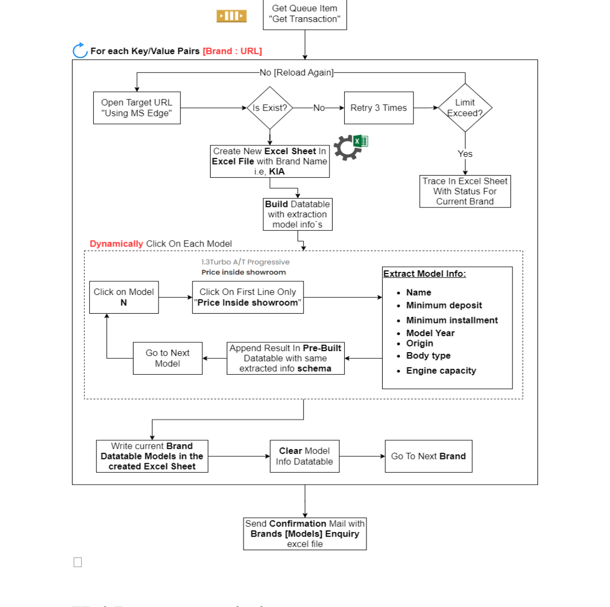

# Auto Samir Rayan Performer Bot

## Project Description

This UiPath process automates the collection of car model data from various websites. The performer bot processes queue items, where each item contains a list of car model links for a specific brand. The bot navigates through these links to gather data on car models, including details such as minimum deposit, installments, country of origin, transmission, and other aspects. The data is collected using flexible HTML selectors to adapt to website changes.

**Performer Bot Overview**

The performer bot operates unattended and is triggered by a queue populated with car model links. It efficiently navigates through car model links, gathers comprehensive data, and ensures accurate data collection and management.

>[!IMPORTANT]
>All file paths used in the project are relative, allowing users to clone the project and use it directly. Outputs are stored in the `Outputs` folder. Ensure that the `Inputs` folder contains necessary files for the bot to function correctly.

## Process Flow Chart

### How to Install

#### Prerequisites

- **UiPath Studio** installed.
- **Microsoft Excel** installed.

#### Steps

1. **Clone the Repository:**
   ```bash
   git clone https://github.com/yehiarasheed/Auto-Samir-Rayan-Performer-Bot
   cd GP-Auto-Rayan-Performer-Bot
   ```

   Alternatively, Clone the Repository in UiPath Studio:
   - Open UiPath Studio.
   - Go to the Team tab.
   - Click on Clone Repository.
   - Enter the repository URL: `https://github.com/yehiarasheed/GP-Auto-Rayan-Performer-Bot`
   - Select the destination folder and click Open using your authentication method of choice.

2. **Install UiPath Studio:** Download and install UiPath Studio from the official UiPath website.

3. **Open the Project in UiPath Studio:**
   - Launch UiPath Studio.
   - Click on Open in the Start tab.
   - Navigate to the cloned repository folder and open the `.xaml` file.

4. **Install Microsoft Excel:** Ensure Microsoft Excel is installed on your computer, as it is required for handling Excel files in this project.

5. **Install Necessary Packages in UiPath:**
   - Open UiPath Studio.
   - Go to the Manage Packages section.
   - Install `UiPath.Excel.Activities`.
   - Install `UiPath.System.Activities`.

### Dependencies

This project requires the following dependencies:
- **Microsoft Excel:** Required for handling Excel files.
- **UiPath.Excel.Activities:** For interacting with Excel files.
- **UiPath.System.Activities:** For general automation tasks.

These dependencies can be managed through UiPath Studio's Package Manager. Ensure all required packages are installed and up-to-date.

### Bot Operation

The Auto Samir Rayan Performer Bot performs the following steps:

1. **Retrieve Queue Items:**
   - Fetch a list of car model links for a specified brand from the queue.

2. **Navigate Through Links:**
   - For each car model link, open the corresponding webpage.
   - Navigate through different car versions (trims) for each model link.

3. **Data Extraction:**
   - Extract details such as minimum deposit, installments, car model country of origin, transmission, and other attributes.
   - Utilize flexible HTML selectors to adapt to future changes in website structure.

4. **Data Storage:**
   - Save the extracted data in the `Outputs` folder.

5. **Logging:**
   - Log success or errors during processing.

6. **Send Confirmation Email:**
   - Send a confirmation email with the results and any relevant attachments.


---
